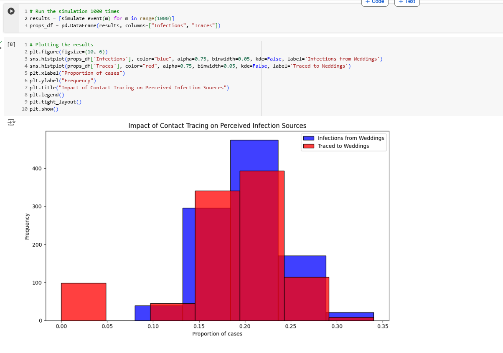

# ASSIGNMENT: Sampling and Reproducibility in Python

Read the blog post [Contact tracing can give a biased sample of COVID-19 cases](https://andrewwhitby.com/2020/11/24/contact-tracing-biased/) by Andrew Whitby to understand the context and motivation behind the simulation model we will be examining.

Examine the code in `whitby_covid_tracing.py`. Identify all stages at which sampling is occurring in the model. Describe in words the sampling procedure, referencing the functions used, sample size, sampling frame, any underlying distributions involved, and how these relate to the procedure outlined in the blog post.

Run the Python script file called whitby_covid_tracing.py as is and compare the results to the graphs in the original blog post. Does this code appear to reproduce the graphs from the original blog post?

Modify the number of repetitions in the simulation to 1000 (from the original 50000). Run the script multiple times and observe the outputted graphs. Comment on the reproducibility of the results.

Alter the code so that it is reproducible. Describe the changes you made to the code and how they affected the reproducibility of the script file. The output does not need to match Whitby’s original blogpost/graphs, it just needs to produce the same output when run multiple times

# Author: Bashar Nusir

**stages at which sampling is occurring in the model:**
1. **Sample attendance in all events:** \
      **Sample Frame:** 1,000 attendees, with 200 attending weddings and 800 attending brunches.
**Procedure:** Individuals are assigned to either "wedding" or "brunch" events.\
**Distribution:**  deterministic, with a fixed distribution (20% for weddings and 80% for brunches), not sampled probabilistically.\
**Relevance:**  clear attendance lists for weddings vs. non clear attendance lists for brunches.\
\
2. **Infection Sampling (infected_indices Selection):**\
**Function:** np.random.choice\
**Sample Size:** 10% of the 1,000 attendees.\
**Sampling Frame:** All attendees (1,000 people).\
**Procedure:** Random sampling selects a subset of attendees with infection status for each event type.\
**Distribution:** each attendee has a 10% probability of being infected.\
**Relevance:** .\
\
3. **Primary Contact Tracing Success Sampling** \
**Function:** np.random.rand.\
**Sample Size:** 20% of infected individuals.\
**Sampling Frame:** Only the infected individuals identified in the previous stage.\
**Procedure:** \
**Relevance:** \
\
4. **Secondary Contact Tracing Triggering:** \
**Sample Frame:** The infected individuals who were successfully traced in the primary stage, grouped by event type.\
**Procedure:** Counts the number of traced cases per event type. If two or more cases in an event type are successfully traced, secondary tracing is triggered, marking all infected individuals from that event as traced.\
**Distribution:**\
**Relevance:**\
\
5. **Simulation Iteration Sampling:**\
**Function:** simulate_event\
**Sample Size:** 50,000 simulations.\
**Sampling Frame:** Each simulation run generates a new, independent sample of the infection and tracing process based on the outlined parameters.\
**Distribution:** Each simulation is an independent trial. \
**Relevance:**\
\
**Question:**\
Run the Python script file called whitby_covid_tracing.py as is and compare the results to the graphs in the original blog post. Does this code appear to reproduce the graphs from the original blog post?\
**Answer:** No\
\
**Question:**\
Modify the number of repetitions in the simulation to 1000 (from the original 50000). Run the script multiple times and observe the outputted graphs. Comment on the reproducibility of the results.\
**Answer:** 
Code Changed is:\
**# Run the simulation 1000 times**\
results = [simulate_event(m) for m in range(**1000**)]\
props_df = pd.DataFrame(results, columns=["Infections", "Traces"])\
\
**The Graph is Same**\

\
**Question:**\
Alter the code so that it is reproducible. Describe the changes you made to the code and how they affected the reproducibility of the script file.\
**Answer:**\
No, Not reproducibility, \
we need to add the following to the code:\
**np.random.seed(42)**

## Criteria

|Criteria|Complete|Incomplete|
|--------|----|----|
|Altercation of the code|The code changes made, made it reproducible.|The code is still not reproducible.|
|Description of changes|The author explained the reasonings for the changes made well.|The author did not explain the reasonings for the changes made well.|

## Submission Information

🚨 **Please review our [Assignment Submission Guide](https://github.com/UofT-DSI/onboarding/blob/main/onboarding_documents/submissions.md)** 🚨 for detailed instructions on how to format, branch, and submit your work. Following these guidelines is crucial for your submissions to be evaluated correctly.

### Submission Parameters:
* Submission Due Date: `HH:MM AM/PM - DD/MM/YYYY`
* The branch name for your repo should be: `sampling-and-reproducibility`
* What to submit for this assignment:
    * This markdown file (sampling_and_reproducibility.md) should be populated.
    * The `whitby_covid_tracing.py` should be changed.
* What the pull request link should look like for this assignment: `https://github.com/<your_github_username>/sampling/pull/<pr_id>`
    * Open a private window in your browser. Copy and paste the link to your pull request into the address bar. Make sure you can see your pull request properly. This helps the technical facilitator and learning support staff review your submission easily.

Checklist:
- [ ] Create a branch called `sampling-and-reproducibility`.
- [ ] Ensure that the repository is public.
- [ ] Review [the PR description guidelines](https://github.com/UofT-DSI/onboarding/blob/main/onboarding_documents/submissions.md#guidelines-for-pull-request-descriptions) and adhere to them.
- [ ] Verify that the link is accessible in a private browser window.

If you encounter any difficulties or have questions, please don't hesitate to reach out to our team via our Slack at `#cohort-3-help`. Our Technical Facilitators and Learning Support staff are here to help you navigate any challenges.
